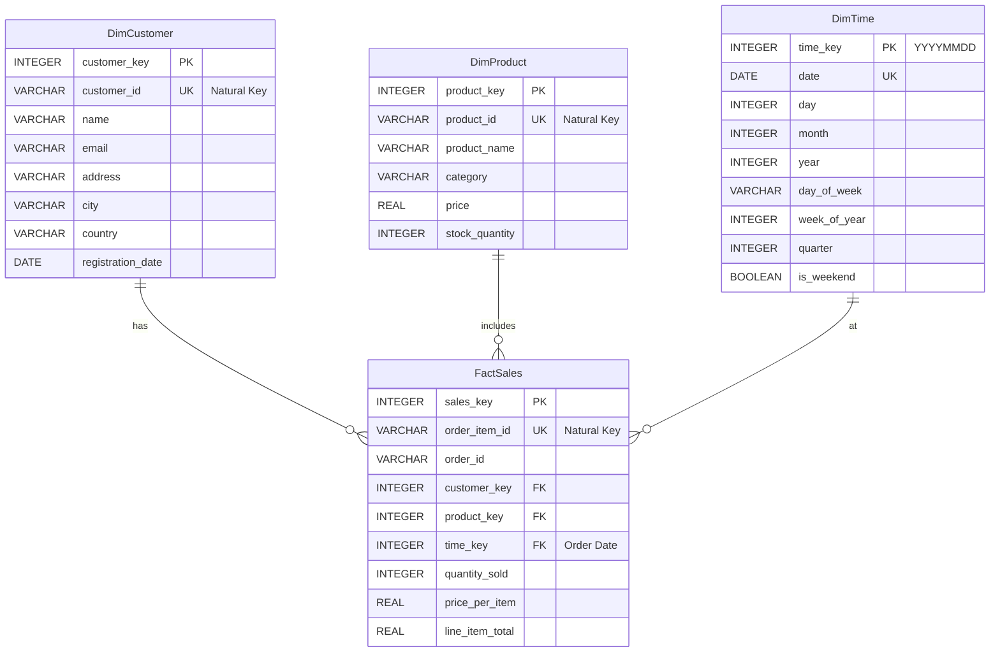

 E-Commerce-Data-Warehouse-Advanced-Analytics-Platform-Project

 PROJECT OVERVIEW 

This project establishes a comprehensive data warehouse and analytics platform for an e-commerce business. It involves simulating realistic operational data, designing and building a data warehouse using a star schema, implementing an ETL (Extract, Transform, Load) pipeline to populate the warehouse, performing advanced SQL analytics on the data, and visualizing key performance indicators (KPIs) and analytical insights through an interactive Streamlit dashboard.

The platform aims to provide valuable insights into customer behavior, product performance, sales trends, and overall business health, enabling data-driven decision-making.

 Data Warehouse Schema

The data warehouse is designed using a Star Schema, which is optimized for querying and reporting. It consists of one central fact table (`FactSales`) and several dimension tables (`DimCustomer`, `DimProduct`, `DimTime`).

 CONCEPTUAL ENTITY-RELATIONSHIP DIAGRAM (ERD)


EXPLANATION:

-   FactSales: This is the central table containing granular sales transaction line items. Each row represents a single item within an order. It includes measures like `quantity_sold`, `price_per_item`, and `line_item_total`. It connects to the dimension tables via foreign keys.
-   DimCustomer: Stores attributes about customers, such as name, email, address, city, country, and registration date.
-   DimProduct: Stores attributes about products, such as name, category, current price, and stock quantity.
-   DimTime: Provides temporal attributes for analysis, allowing filtering and aggregation by year, month, day, day of the week, etc. The `time_key` is an integer representation of the date (YYYYMMDD).

 ETL Pipeline

The ETL process is responsible for extracting data from the raw operational data sources, transforming it into the data warehouse schema, and loading it into the SQLite database.

1.  EXTRACTION: The raw data (customers, products, orders, order items) is simulated using the `Faker` library and loaded into pandas DataFrames (`customers_df`, `products_df`, `orders_df`, `order_items_df`). In a real-world scenario, this step would involve connecting to source databases, APIs, or files.
2.  TRANSFORMATION: The raw data in the pandas DataFrames is transformed to conform to the data warehouse schema:
    -   Dimension tables (`DimCustomer`, `DimProduct`, `DimTime`) are created with surrogate keys.
    -   `DimTime` is populated with time-based attributes derived from the order dates.
    -   The `FactSales` table is constructed by joining the order items, orders, customers, and time data, calculating the `line_item_total`, and adding foreign keys to the dimension tables.
    -   Basic data cleaning and type conversions are performed.
3.  LOADING: The transformed pandas DataFrames (`dim_customer_df`, `dim_product_df`, `dim_time_df`, `fact_sales_df`) are loaded into the respective tables in the `ecommerce_dwh.db` SQLite database using SQLAlchemy. The `if_exists='replace'` option is used for simplicity in this project, replacing the tables on each run.

 ETL Automation (Simulation)

In a production environment, the ETL process would be automated to run on a schedule (e.g., daily). Common tools for this include:

-   Cron Jobs / Task Scheduler: For simple, script-based automation.
-   Workflow Orchestrators (e.g., Apache Airflow): For complex pipelines with dependencies, monitoring, and error handling.
-   Cloud ETL Services (e.g., AWS Glue): 
Managed services for scalable, serverless ETL.

In this project, the ETL process is simulated within the Python script (`app.py` or separate ETL scripts if created) by encapsulating the transformation and loading logic into functions that can be executed.

ADVANCED SQL ANALYTICS

Several key analytical queries are performed directly against the data warehouse using SQL to derive business insights.

1.  Cohort Analysis:
    -   Purpose: To understand customer retention and value over time based on their acquisition cohort (registration month). Tracks the spending of each cohort in subsequent months.
    -   SQL Query:
        ```sql
        WITH CustomerCohort AS (
            SELECT
                customer_key,
                strftime('%Y-%m', registration_date) AS cohort_month
            FROM DimCustomer
        ),
        MonthlySales AS (
            SELECT
                fs.customer_key,
                strftime('%Y-%m', dt.date) AS order_month,
                SUM(fs.line_item_total) AS monthly_spending
            FROM FactSales fs
            JOIN DimTime dt ON fs.time_key = dt.time_key
            GROUP BY fs.customer_key, order_month
        ),
        CohortActivity AS (
            SELECT
                cc.cohort_month,
                ms.order_month,
                SUM(ms.monthly_spending) AS total_spending
            FROM CustomerCohort cc
            JOIN MonthlySales ms ON cc.customer_key = ms.customer_key
            GROUP BY cc.cohort_month, ms.order_month
        ),
        CohortIndex AS (
            SELECT
                cohort_month,
                order_month,
                (CAST(substr(order_month, 1, 4) AS INTEGER) - CAST(substr(cohort_month, 1, 4) AS INTEGER)) * 12 +
                (CAST(substr(order_month, 6, 2) AS INTEGER) - CAST(substr(cohort_month, 6, 2) AS INTEGER)) AS month_index,
                total_spending
            FROM CohortActivity
        )
        SELECT
            cohort_month,
            month_index,
            SUM(total_spending) AS total_spending
        FROM CohortIndex
        GROUP BY cohort_month, month_index
        ORDER BY cohort_month, month_index;
        ```

2.  Product Attribution (Co-Purchase Analysis):
    -   Purpose: To identify which products are frequently purchased together, helping with product bundling, recommendations, and store layout/website design. This query performs a simple co-occurrence analysis.
    -   SQL Query:
        ```sql
        WITH OrderProducts AS (
            SELECT
                order_id,
                product_key
            FROM FactSales
            GROUP BY order_id, product_key
        )
        SELECT
            p1.product_name AS product1,
            p2.product_name AS product2,
            COUNT(*) AS co_purchase_count
        FROM OrderProducts op1
        JOIN OrderProducts op2 ON op1.order_id = op2.order_id AND op1.product_key < op2.product_key
        JOIN DimProduct p1 ON op1.product_key = p1.product_key
        JOIN DimProduct p2 ON op2.product_key = p2.product_key
        GROUP BY p1.product_name, p2.product_name
        ORDER BY co_purchase_count DESC
        LIMIT 10;
        ```

3.  RFM (Recency, Frequency, Monetary) Analysis:
    -   **Purpose:** To segment customers based on their recent purchasing activity (Recency), how often they purchase (Frequency), and how much they spend (Monetary). This helps identify high-value, loyal, and at-risk customers.
    -   SQL Query:
        ```sql
        WITH CustomerSales AS (
            SELECT
                customer_key,
                MAX(dt.date) AS last_order_date,
                COUNT(DISTINCT fs.order_id) AS frequency,
                SUM(fs.line_item_total) AS monetary_value
            FROM FactSales fs
            JOIN DimTime dt ON fs.time_key = dt.time_key
            GROUP BY customer_key
        ),
        RFM_Scores AS (
            SELECT
                customer_key,
                last_order_date,
                frequency,
                monetary_value,
                NTILE(5) OVER (ORDER BY last_order_date DESC) AS r_score,
                NTILE(5) OVER (ORDER BY frequency ASC) AS f_score,
                NTILE(5) OVER (ORDER BY monetary_value ASC) AS m_score
            FROM CustomerSales
        )
        SELECT
            c.name AS customer_name,
            r.last_order_date,
            r.frequency,
            r.monetary_value,
            r.r_score,
            r.f_score,
            r.m_score,
            (CAST(r.r_score AS TEXT) || CAST(r.f_score AS TEXT) || CAST(r.m_score AS TEXT)) AS rfm_segment
        FROM RFM_Scores r
        JOIN DimCustomer c ON r.customer_key = c.customer_key
        ORDER BY rfm_segment DESC;
        ```

4.  Customer Lifetime Value (CLV):
    -   Purpose: To estimate the total revenue a customer is expected to generate throughout their relationship with the business. This query calculates a simple historical CLV based on total spending.
    -   **SQL Query:**
        ```sql
        WITH CustomerMetrics AS (
            SELECT
                customer_key,
                COUNT(DISTINCT order_id) AS total_orders,
                SUM(line_item_total) AS total_spending,
                CAST((JulianDay(MAX(dt.date)) - JulianDay(MIN(dt.date))) AS REAL) / 365.25 AS customer_lifespan_years
            FROM FactSales fs
            JOIN DimTime dt ON fs.time_key = dt.time_key
            GROUP BY customer_key
        ),
        CLV_Calculation AS (
            SELECT
                customer_key,
                total_spending,
                total_orders,
                customer_lifespan_years,
                CASE
                    WHEN total_orders > 0 THEN total_spending * 1.0 / total_orders
                    ELSE 0
                END AS average_purchase_value,
                CASE
                     WHEN customer_lifespan_years > 0 THEN total_orders * 1.0 / customer_lifespan_years
                     ELSE 0
                END AS purchase_frequency_per_year
            FROM CustomerMetrics
        )
        SELECT
            c.name AS customer_name,
            clv.total_spending,
            clv.total_orders,
            clv.customer_lifespan_years,
            clv.average_purchase_value,
            clv.purchase_frequency_per_year
        FROM CLV_Calculation clv
        JOIN DimCustomer c ON clv.customer_key = c.customer_key
        ORDER BY total_spending DESC;
        ```

STREAMLIT DASHBOARD

An interactive dashboard is built using Streamlit to visualize the data warehouse insights.

Setup and Running

1.  Prerequisites: Ensure you have Python installed. You also need to have run the previous steps of this project to create the `ecommerce_dwh.db` file and populate it with data.
2.  Install Libraries: Install the required Python libraries:
    ```bash
    pip install streamlit pandas sqlite3 matplotlib seaborn plotly sqlalchemy
    ```
3.  Save the App: Save the Python code generated for the dashboard (`app.py`) in the same directory as your `ecommerce_dwh.db` file.
4.  Run the Dashboard:  Open your terminal or command prompt, navigate to the project directory, and run the following command:
    ```bash
    streamlit run app.py
    ```
    This will start the Streamlit server, and your web browser will open with the dashboard.

Interactivity Features

The dashboard includes several interactive elements to allow users to explore the data:

-   Date Range Filter:  Use the date pickers in the sidebar to filter the "Total Sales Over Time" chart to a specific period.
-   Product Category Filter: Select a category from the dropdown in the sidebar to filter the "Sales by Product Category" chart (though this chart primarily shows all categories, the filter could be used for drill-down if implemented differently).
-   Customer Country Filter: Select a country from the dropdown in the sidebar to filter the "Sales by Customer Country" chart.
-   Top N Products Slider: Adjust the slider in the sidebar to control how many of the top-selling products are displayed in the "Top Products by Sales" chart.

 CODE COMMENTS

All relevant Python code files, particularly the `app.py` file containing the Streamlit dashboard logic and the ETL scripts (if separated), should include clear and concise comments explaining:

-   The purpose of functions and classes.
-   Complex logic or calculations.
-   Database interactions and SQL queries.
-   Streamlit component usage.
-   Any assumptions made.

